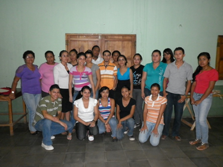
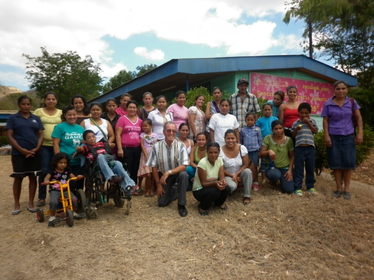
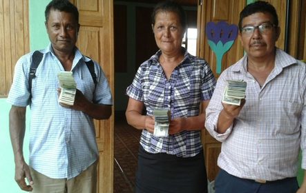
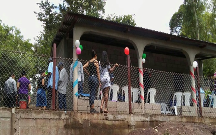
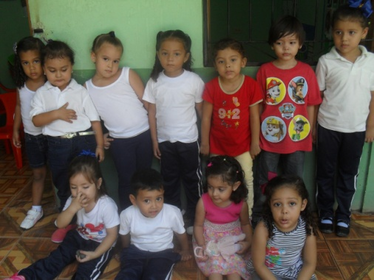
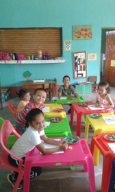
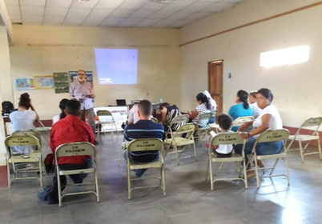

# Beques per a estudiant universitaris

Aquest és un petit projecte d’ajuda a estudiants universitaris pel transport fins a la universitat a Estelí, capital del departament, distant uns 40 km.

# Apadrinaments

La situació dels infants discapacitats, molt abundants per les condicions socials i sanitàries del país, és molt precària, sobre tot si viuen en comunitats molt apartades del nucli urbà o en barris perifèrics. Per ajudar a les famílies d’aquests nens/es existeix l’associació “Los Pipitos” (terme carinyòs per referir-se a aquests nens). 

A través de Banyoles Solidària 23 d’aquests nens/es reben cada mes una ajuda econòmica finançada per famílies o persones del Pla de l’Estany i d’altres indrets. Els padrins reben periòdicament informació dels seus apadrinats.

# Microcrèdits

Els microcrèdits són petits crèdits a retornar amb condicions molt favorables per als petits camperols que no tenen accés al crèdit especulatiu dels bancs. Els microcrèdits possibiliten la compra d’”insumos” per les seves activitats agrícoles o per petits negocis familiars. Molt sovint serveixen per poder viatjar a Costa Rica a treballar en la recol·lecció de la canya. 

Des de fa anys a tres comunitats rurals (Potrerillos, El Peñasco i La Laguna) estan funcionant amb èxit tres cooperatives de microcrèdits que es van iniciar com a “banquitospopulares” amb el suport de Banyoles Solidària i d’alguns ajuntaments de la comarca.  Des de l’any2012 estan legalment reconegudes.

Amb el fons creat cada any es beneficien molts camperols i les seves famílies. L’any 2016 amb la subvenció de l’ajuntament de Banyoles van construir un local social i les oficines a cadascuna 
d’aquestes tres comunitats.

 

# Sala educativa i recreativa xilonem (guarderia)

Aquest projecte es va iniciar l’any 2016 per a donar atenció a nens/es de 3 a 5 anys en un espai d’atenció, educació i aprenentatge per a nens/es de 3-4 anys, instal·lat als locals de la Red de Mujeres de Condega. 

Els seus objectius específics són:

* Donar atenció personalitzada i de qualitat a la mainada.
* Propiciar un ambient segur i agradable.
* Desenvolupar activitats d’autonomia i socialització.
* Estimular àrees de desenvolupament motor, sensorial i de llenguatge.
* Possibilitar a les mares/pares unes hores lliures per poder anar a treballar.

Actualment la matrícula és de 20 nens/es, atesos per dues educadores. 
Econòmicament te el suport dels ajuntaments de Palol de Revardit i de Serinyà a través de Banyoles Solidària.

 

# Agenda Llatinoamericana

L’Agenda Llatinoamericana és una eina de reflexió sobre el món actual des de la perspectiva de les grans causes. Cada any Banyoles Solidària subvenciona unes 40 agendes pels mestres i educadors comunitaris de Condega que la fan servir com a guia i base del seu treball educatiu.
El coordinador de la campanya, en Jordi Planas, sol fer una presentació a aquella ciutat.

