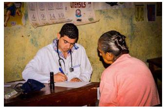
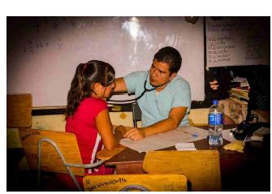
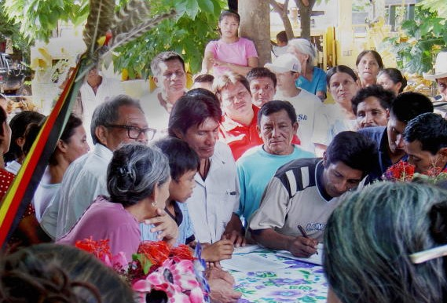
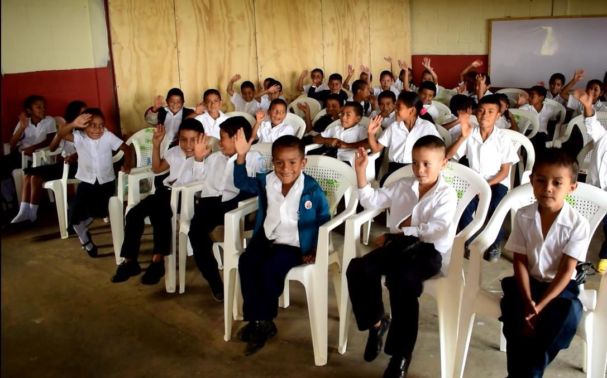
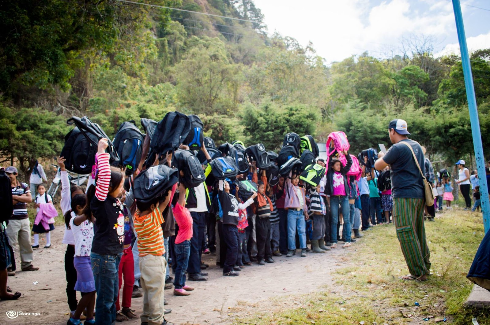
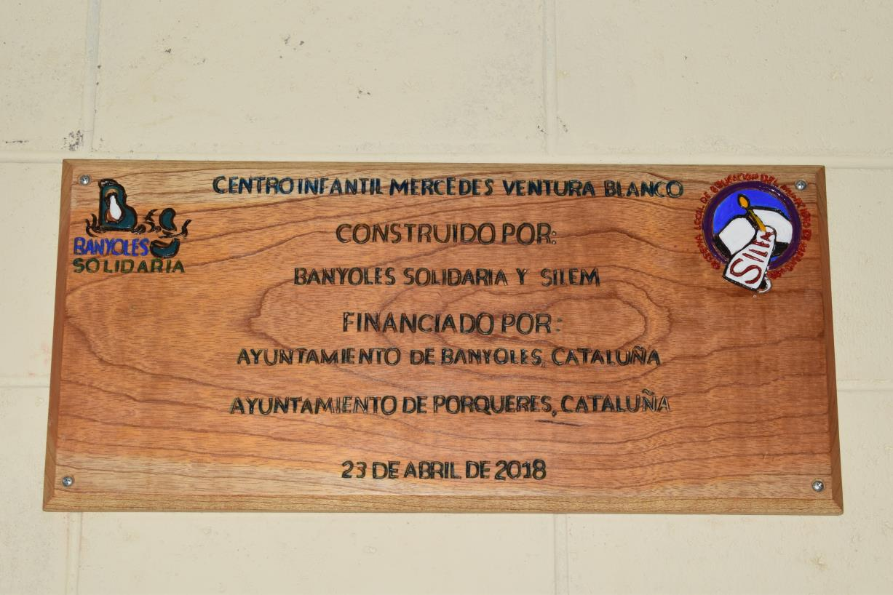
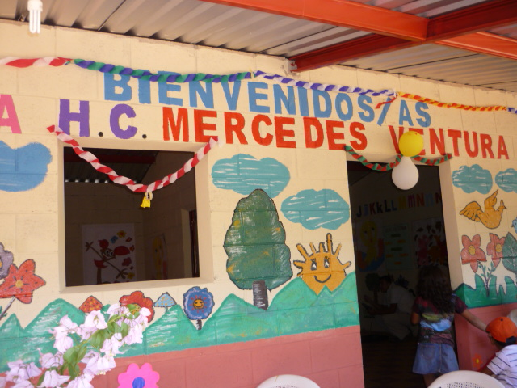

La cooperació de Banyoles Solidària a El Salvador es fa en el departament de Morazán, el més pobre del país i on en la seva guerra civil (1979-1992) hi hagué la màxima violència contra la seva població camperola i indígena. Els projectes es desenvolupen a través del SILEM, organisme popular que actua de contrapart.

L’acció més important s’ha desenvolupat a Segundo Montes comunitat creada pels refugiats que fugiren a Hondures i en comunitats rurals del seu entorn: Meanguera, Guatajiagua, Torola, Aguas Zarcas, Aguas Frías, San Fernando, Jocoaitique; Guacamaya, entre d’altres.

  

Els projectes tot i ser d’abast variat (apoderament de la dona, ajut a sectors socials desafavorits: avis, infants, dones; suports alimentaris o mèdics; potenciació moviments de joves i de dinàmiques culturals; dotació d’aigua potable; compra de pick-up pel serveis de la comunitat; compra de les terres on residia la comunitat lenca i lliurament de la seva propietat a les famílies lenca. Especialment, però, l’ajut prioritaris’ha destinat al desenvolupament educatiu on s’han construït, fins avui, 14 escoles (majoritàriament centres d’educació infantil) y una elles un centre d’educació especial;inversions per adequacions, millores i reparacions i, dotacions pedagògiques diverses.

